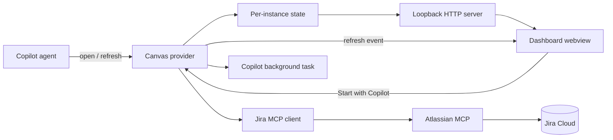

# Jira Sprint Dashboard

A read-only Copilot CLI canvas extension that turns Jira issues from currently
open sprints into a compact engineering dashboard. It highlights flow, owner
load, attention items, top-priority work, and recently completed work.

This plugin is one package in the **Atlassian Copilot marketplace** library
(generic host for Atlassian Copilot plugins). Canvas source lives in
[`extensions/`](../../extensions/) at the marketplace root. This plugin
directory holds `plugin.json` and this README only.

## Modules

| File | Responsibility |
| --- | --- |
| [`extension.mjs`](../../extensions/extension.mjs) | Registers the canvas and refresh action, owns per-instance state, and runs one loopback HTTP server per open canvas. |
| [`server/jira-client.mjs`](../../extensions/server/jira-client.mjs) | Discovers Jira MCP capabilities, performs complete cursor pagination, and reads authoritative tool content. |
| [`server/start-copilot.mjs`](../../extensions/server/start-copilot.mjs) | Builds a bounded prompt from the allowlisted dashboard issue model and starts Copilot work for a selected issue. |
| [`ui/dashboard.mjs`](../../extensions/ui/dashboard.mjs) | Normalizes the allowlisted Jira display model and renders the responsive dashboard HTML. |
| [`tests/`](../../extensions/tests/) | Verifies MCP pagination/content handling, model privacy, URL validation, and dashboard rendering. |

## Architecture



Each canvas instance owns its state and server. Opening performs a fresh Jira
read before returning the webview URL. The `refresh_dashboard` action uses the
same fetch/model path and retains the last successful model if a later refresh
fails.

The webview has no manual refresh control. It renders exactly four top-level
statistics followed by supported charts, owner load, risk and attention,
highest-priority work, and recently completed work. Jira keys are visibly
underlined links validated against the selected Jira site.

## Open input

The canvas requires a resolved Jira site at its open boundary:

```json
{
  "cloudId": "<selected Jira cloud ID>",
  "siteUrl": "https://example.atlassian.net"
}
```

Additional properties are rejected. The identifiers seed a new instance; all
visible Jira facts come from the live post-open fetch.

## Actions

- `refresh_dashboard` refreshes Jira through the same fetch and normalization
  path used during open. On failure it reports a non-success result and keeps
  the last successful dashboard visible with a stale-data notice.

The issue tables also expose a **Start with Copilot** button. It starts a
background Copilot task when supported, with a current-session fallback for
runtimes that do not expose background tasks. It does not perform a Jira write.

## Validation

From the marketplace root (`public/`):

```bash
node --check extensions/extension.mjs
node --check extensions/server/jira-client.mjs
node --check extensions/server/start-copilot.mjs
node --check extensions/ui/dashboard.mjs
node --test extensions/tests/*.test.mjs
```
